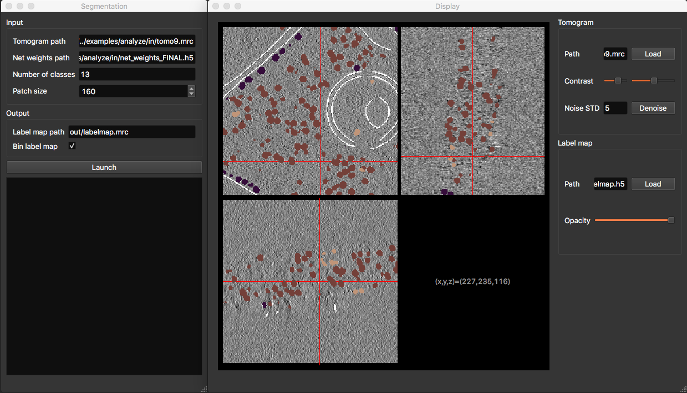

# Deep Finder

The code in this repository is described in [this pre-print](https://www.biorxiv.org/content/10.1101/2020.04.15.042747v1). This paper has now been [published](https://doi.org/10.1038/s41592-021-01275-4) in Nature Methods.

**News**: (27/11/23) DeepFinder exists now as a Napari plugin

## Contents
- [System requirements](##System requirements)
- [Installation guide](##Installation guide)
- [Instructions for use](##Instructions for use)
- [Documentation](https://cryoet-deepfinder.readthedocs.io/en/latest/)
- [Google group](https://groups.google.com/g/deepfinder)

## System requirements
**Deep Finder** has been implemented using **Python 3** and is based on the **Tensorflow** package. It has been tested on Linux (Debian 10), and should also work on Mac OSX as well as Windows.

The algorithm needs an **Nvidia GPU** and **CUDA** to run at reasonable speed (in particular for training). The present code has been tested on Tesla K80 and M40 GPUs. For running on other GPUs, some parameter values (e.g. patch and batch sizes) may need to be changed to adapt to available memory.

### Package dependencies
Deep Finder depends on following packages. The package versions for which our software has been tested are displayed in brackets:
```
tensorflow   (2.11.1)
lxml         (4.9.3)
mrcfile      (1.4.3)
scikit-learn (1.3.2)
scikit-image (0.22.0)
matplotlib   (3.8.1)
PyQt5        (5.15.10)
pyqtgraph    (0.13.3)
openpyxl     (3.1.2)
pycm         (4.0)
```

## Installation guide
Before installation, you need a python environment on your machine. If this is not the case, we advise installing [Miniconda](https://docs.conda.io/en/latest/miniconda.html).

(Optional) Before installation, we recommend first creating a virtual environment that will contain your DeepFinder installation:
```
conda create --name dfinder python=3.9
conda activate dfinder
```

Now, you can install DeepFinder with pip:
```
pip install cryoet-deepfinder
```

Also, in order for Keras to work with your Nvidia GPU, you need to install CUDA. Once these steps have been achieved, the user should be able to run DeepFinder.

## Instructions for use
### Using the scripts
Instructions for using Deep Finder are contained in folder examples/. The scripts contain comments on how the toolbox should be used. To run a script, first place yourself in its folder. For example, to run the target generation script:
```
cd examples/training/
python step1_generate_target.py
```

### Using the GUI
The GUI (Graphical User Interface) should be more intuitive for those who are not used to work with script. Currently, 5 GUIs are available (tomogram annotation, target generation, training, segmentation, clustering) and allow the same functionalities as the scripts in example/. To run a GUI, first open a terminal. For example, to run the segmentation GUI:
```
segment
```



==Important information:== Except for the training, the using of the GUI is depreciated. We advise using the [Napari plugin](https://github.com/deep-finder/napari-deepfinder) instead.

For more informations about how to use DeepFinder, please refer to the [documentation](https://cryoet-deepfinder.readthedocs.io/en/latest/).

__Notes:__ 
- working examples are contained in examples/analyze/, where Deep Finder processes the test tomogram from the [SHREC'19 challenge](http://www2.projects.science.uu.nl/shrec/cryo-et/2019/). 
- The script in examples/training/ will fail because the training data is not included in this Gitlab. 
- The evaluation script (examples/analyze/step3_launch_evaluation.py) is the one used in SHREC'19, which needs additional packages (pathlib and pycm, can be installed with pip). The performance of Deep Finder has been evaluated by an independent group, and the result of this evaluation has been published in Gubins & al., "SHREC'19 track: Classification in cryo-electron tomograms".
