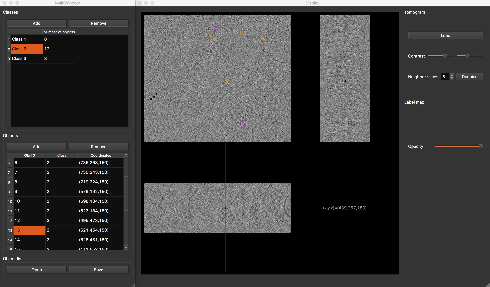
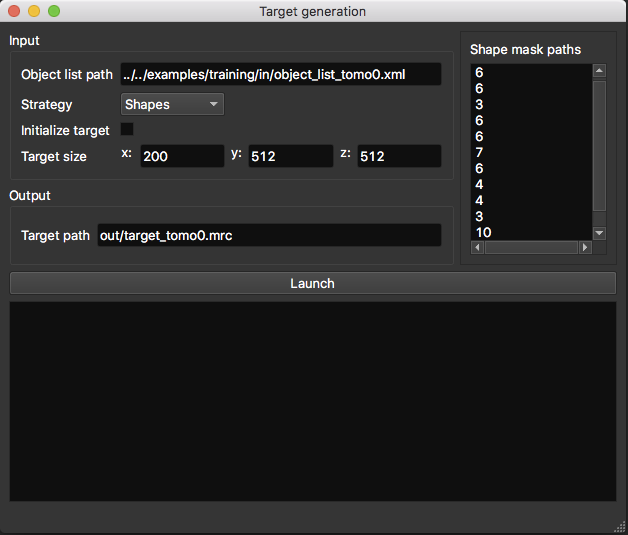
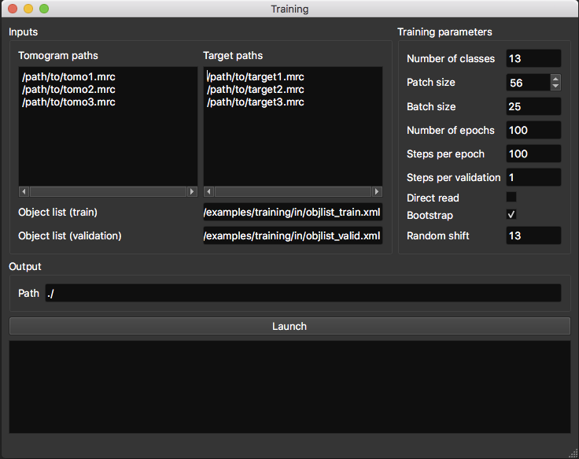
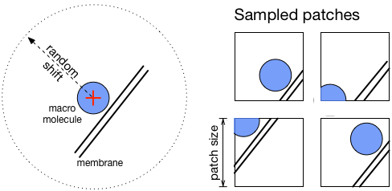
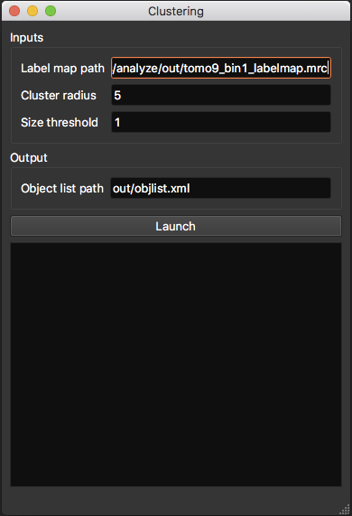

.. _guide:

Guide
=====

DeepFinder consists of 5 steps (blue boxes below), which constitute a workflow that allows to locate macromolecular
complexes in crowded cells, when executed in depicted order. Each step can be executed either using a script (see examples/)
or using the graphical user interface (see pyqt/). 
Note that the more up-to-date [napari-deepfinder](https://github.com/deep-finder/napari-deepfinder) plugin can also be used to annotate and segment your images.
These steps may be used in other workflows, e.g. if the user
needs only the segmentation step.

.. figure::  ../../images/deepfinder_workflow.png
   :align:   center

   DeepFinder workflow

**Vocabulary:**

* **Object list:** contains information on annotated or found macromolecular complexes
* **Label map:** segmentation map, i.e. a 3D array of integers {0,...,Nclasses}, where '0' is reserved for the background class.
* **Target:** a label map used for training

.. note::
   DeepFinder can read and write tomograms in **mrc**, **map** and **h5** formats.

Annotation
----------
DeepFinder provides a GUI for annotating your tomograms. The goal is to constitute an object list per tomogram.
The term 'object' corresponds here to a macromolecular complex.

The object list
+++++++++++++++
An object list contains following information:

* Class label
* Coordinates (x,y,z)
* Orientation (phi,psi,theta): needed for generating shape targets
* Tomogram index: needed for training
* Cluster size: obtained after clustering step

A list contains at least class label and coordinates of each object. Other information (e.g. orientation etc) is included
depending on considered operation (e.g. shape target generation).

.. note::
   An object list can be saved in **xlsx** or in **xml** format. This allows you to edit your object lists in Excel or in a text editor (for ex. for merging object lists).

.. note::
   The API provides several functions for editing object lists in your scripts. You can for ex. scale coordinates, extract all objects from a specific class etc. See API section for more information.

Display window
++++++++++++++
This window allows to explore a tomogram with ortho-slices (i.e. 2D slices in each dimension). By clicking on the slices,
you can scan through the volume in x, y and z directions. Furthermore, you can adjust the contrast interactively and
denoise the slices to improve visibility. Denoising is performed by averaging neighboring slices, the number of neighbors
being configurable by the user.

Also, a label map (i.e. segmentation map) can be superimposed on the tomogram slices and its opacity can be adapted.

Annotation GUI
+++++++++++++++++

   Annotation GUI

The annotation graphical interface is constituted of a display window and an annotation window, and allows you to
interactively annotate your tomograms. First, select desired class. Then browse your tomogram to find instances of
desired macromolecule species, and double-clic on their position. You will see a dot appearing on the tomogram slices
and a row appear in the object table, confirming that the position has been saved. Repeat the process until all visible
macromolecules have been annotated. To finish, save your object list. In the same way, annotate as many tomograms as you
can, then proceed to the next step.

.. note::
   As annotation is a time-consuming task, you can save the current state and resume the task where you left it by
   saving the object list.

Target generation
-----------------

This step converts an object list (i.e. position-wise annotations) into a label map (i.e. voxel-wise annotation).
We propose two strategies to do so: **spheres** and **shapes**.

   Target generation GUI

* **Object list path**: path to the object list obtained from the annotation procedure.
* **Initialize target**: allow you to initialize the target with an array already containing annotated structures like membranes.
* **Target size** (in voxels): if you don't use the target initialization option, you need to specify the size of your target volume, which should be the same size as the tomogram it describes.
* **Target path**: where the target volume should be saved.

Sphere targets
++++++++++++++
Here, targets are generated by placing a sphere at positions contained in the object list. You can specify a different
radius per class. This radius should correspond to the size of the object. This technique is quick to execute in comparison
to 'shapes' and yields decent results.

* **Radius list** (in voxels): sphere radius per class. The list order should correspond to the class label as follows: 1st line -> radius of class 1 ; 2nd line -> radius of class 2 ...

Shape targets
+++++++++++++
This strategy is more precise but needs more time and external tools to execute. Instead of using spheres, more precise
masks (corresponding to macromolecule shapes) are placed at specified positions. However, to obtain these masks and also
the orientation of each object, a sub-tomogram averaging procedure is needed (as available in PyTOM or Scipion).
So using this strategy involves more efforts and time, but yields better results, especially for small objects.

* **Shape mask paths**: list of mask paths (1 mask per class). The masks are 3D arrays which contain the shape of macromolecules ('1' for 'is object' and '0' for 'is not object'). The path order should correspond to the class label as follows: 1st line -> path to mask of class 1 ; 2nd line -> path to mask of class 2 ...

.. warning::
   When the 'shapes' strategy is selected, the object list needs to contain the orientation (i.e. Euler angles) of each object.

Training
--------
.. note::
   If you are a beginner in deep learning, and would like to gain a general understanding, you can read Section 3 "An introduction to deep learning" of E. Moebel's (author of DeepFinder) `PhD thesis <https://hal.inria.fr/tel-02153877>`_ .

Before running the training procedure, it is good practice to define a validation set, which is a subset of your training set.
Then, this validation set will not be used for training, but for computing metrics to evaluate training performance.
This is helpful for checking for **overfitting**.
Intuitively, overfitting happens when instead of learning discriminating features of objects,
the network learns them by heart. Consequently, like a bad student, the network is unable to generalize its knowledge to
new data and produces a classification of poor quality.
You can detect overfitting by comparing training loss and validation loss curves (or accuracy curves). If they have similar values, then training is efficient.
If they diverge, then there is overfitting.

You can define which of your annotated objects you want to use for training and for validation by storing them in separate
object lists (see image below). Ideally, the validation objects should originate from a different tomogram than the
training objects. If this is not possible, try to choose validation objects that are not too close to training
objects. The minimum size of validation set should be **at least** few dozen objects per class, **ideally** a few hundreds.

   Training GUI

DeepFinder expects the dataset folder to be organized as follows::

    folder
    |-train
    | |-tomo1.mrc
    | |-tomo1_target.mrc
    | |-tomo1_objl.xml
    | |- ...
    |-valid
    | |-tomo8.mrc
    | |-tomo8_target.mrc
    | |-tomo8_objl.xml

* **Dataset path**: give here the path to your dataset folder
* **Initialize weights**: if left empty, the model will be trained from scratch (random initizalisation). Else, you can use this field to resume a previous training session, by indicating the path to the weights obtained from a previous training. Or, if you want to do fine-tuning, you can load weights of a pre-trained DeepFinder model.
* **Output path**: where network weights and training metrics will be saved.

**Training parameters:**

* **Number of classes** (background class included)
* **Patch size** (in voxels): must be a multiple of 4, due to the network architecture.
* **Batch size**: number of patches used to compute average loss.
* **Number of epochs**: at the end of each epoch, evaluation on validation set is performed (usefull to check if network overfits).
* **Steps per epoch**: number of batches trained on per epoch. In the end, the total number of training iterations is [number of epochs]x[steps per epoch].
* **Steps per validation**: number of batches used for validation.
* **Direct read**: if checked, only the current batch is loaded into memory, instead of the whole dataset. Usefull when running out of memory. Transmission speed between dataset storage and GPU should be high enough.
* **Bootstrap**: if checked, applies re-sampling to batch generation, so that each class has an equal chance to be sampled. Usefull when in presence of unbalanced classes. Can remain checked.
* **Random shift** (in voxels): applied to positions in object list when sampling patches. Enhances network robustness. Make sure that objects are still contained in patches after the shift is applied.

   Patch sampling and random shift

Once you filled out all required fields, hit the 'Launch' button. A second window will appear, displaying training metrics in real time,
allowing you to monitor the progress of the procedure. Metrics per class are computed for the validation set (F1-score, precision, recall).
It is common to obtain per-class score values around 0.6, which for our datasets was enough for satisfying localization.
Indeed, even if macromolecules are segmented only partially, it is enough to find them in the Clustering step.

.. note::
   If your machine runs **out of memory**, you can reduce patch size and batch size values.

.. note::
   Every 10 epochs, the network weights are saved at the output path. If your training procedure is interrupted for any reason,
   this allows you to resume the training at last saved network state, instead of starting over from scratch.

Segmentation
------------
Now that your network is trained, it is time to apply it to segment new tomograms. As a tomogram is too large to be
processed in one take, the procedure splits the volume in smaller overlapping 3D patches. You can adapt the patch size
to the available memory on your machine.

.. figure::  ../../images/gui_segment.png
   :align:   center

   Segmentation GUI

* **Tomogram path**
* **Net weights path**: path to the .h5 file containing the network weights obtained by the training procedure.
* **Number of classes** (background class included)
* **Patch size** (in voxels): must be a multiple of 4, due to the network architecture.
* **Label map path**: where the segmented tomogram should be saved.
* **Bin label map**: when checked, also saves a sub-sampled version of the label map. Smaller label maps reduces computing time of clustering step.

Once the segmentation is achieved, a display window appears, allowing you to check the consistency of the result.

Clustering
----------
This procedure analyzes the segmented tomogram (i.e. label map), identifies individual macromolecules and outputs
their coordinates, stored as an object list. This analysis is achieved with the mean-shift clustering algorithm.

   Clustering GUI

* **Label map path**: path to input label map.
* **Cluster radius** (in voxels): parameter for clustering algorithm. Corresponds to average object radius.
* **Object list path**: where the output object list should be saved.
